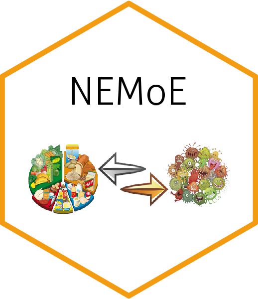

# NEMoE 

NEMoE is an R package implementing a nutrition-aware regularized mixture of experts model, which addresses diet cohort heterogeneity of gut microbiome in certain diseases. Additionally, the implementation can be viewed as a regularized mixture of experts model with an elastic penalty and a binary output. The input can be single-level or multi-level.

## Installation

To use this package you can :
 
install it through
 
``` r
remotes::install_github("SydneyBioX/NEMoE")
```
## Vignette

You can find the vignette at our website: https://sydneybiox.github.io/NEMoE/.

## Contact us
If you have any enquiries, especially about running NEMoE model on your own data, then please contact bioinformatics@maths.usyd.edu.au. You can also open an issue on GitHub.
